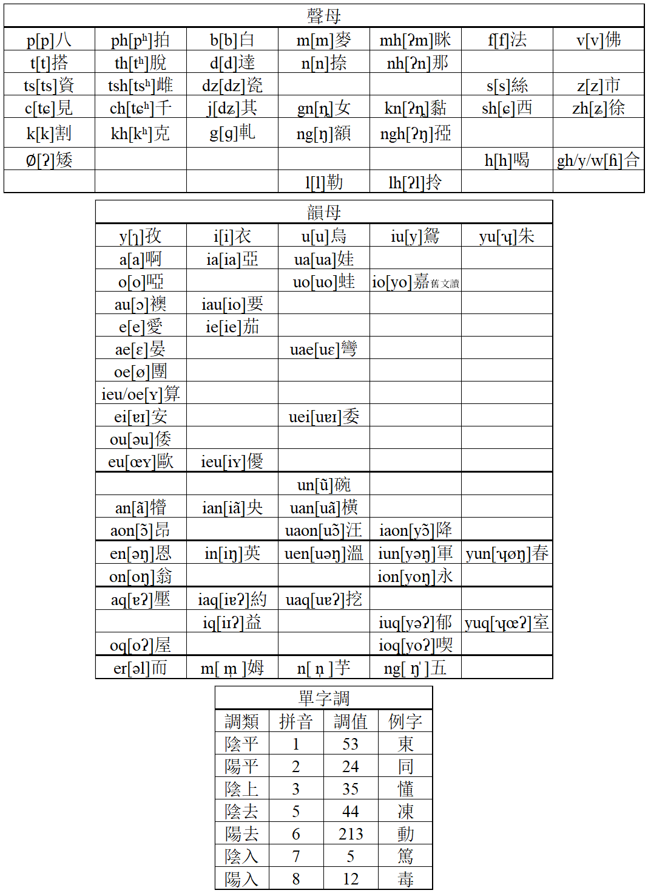

# 寧波吳語注音輸入方案吳語學堂版

## 簡介

基於[Rime中州韻輸入法引擎](https://rime.im/)的寧波話吳語拼音輸入法。

提供寧波城區及鄞縣鍾公廟（鄞縣中區，今鄞州區鍾公廟街道）兩種口音的輸入法。

### 音系及拼音方案

#### 寧波城區



本輸入法中的寧波城區音系以江蘇教育版《寧波方言詞典》爲基礎，綜合了《宁波市志·方言》。相比江蘇教育版的《寧波方言詞典》，區分了[ko]、[kuo]及[kʰo]、[kʰuo]。另外還單獨列出了清鼻音邊音聲母。

[ʏ]韻對應ieu、oe兩種拼音。在聲母t[t]、l[l]、lh[ʔl]之後拼作ieu，在聲母ts[ts]、tsh[tsʰ]、dz[dz]、s[s]、z[z]之後拼作oe。

本輸入法的拼音方案採用吳語學堂式拼音（下稱學堂式），與吳語協會的[通用吳語拼音](http://wu-chinese.com/romanization/ningbo.html)（下稱協會式）接近但有不同。對於寧波城區口音，兩種拼音方案有以下幾點不同。

- 學堂式中，齦顎鼻音[ȵ]拼作gn，協會式中拼作ny。
- 學堂式中，清鼻音邊音聲母拼作mh、nh、kn、ngh和lh，協會式中分別拼作'm、'n、'ny、'ng和'l。
- 學堂式中，「要」字的韻母[io]依據音位原則拼作iau，協會式中依據音值拼作io。
- 學堂式中，「嘉」「霞」等字舊文讀的韻母拼作io，協會式無此韻母（也有人拼作iuo）。
- 學堂式中，老派「降」字文讀的韻母拼作iaon，協會式無此韻母（也有人拼作iuaon）。
- 學堂式使用q表示入聲韻尾，協會式使用h表示入聲韻尾。
- 學堂式中的韻母iun[yəŋ]、iuq[yəʔ]，協會式中也拼作iuin、iueh。
- 學堂式中，老派「春」字的韻母[ʮøŋ]依據音位原則拼作yun，「室」字的韻母[ʮœʔ]依據音位原則拼作yuq。協會式中分別拼作oen和oeh。
- 學堂式中，「而」字的韻母[əl]拼作er，協會式拼作r。
- 學堂式使用數字1-8來表示標註單字調，協會式僅標註平上去入四聲（也有人標註1234）。

#### 鄞縣鍾公廟（鄞縣中區）

本輸入法中的鍾公廟音系採用《鄞县方言同音字汇》中的音系，同樣使用學堂式拼音。

鍾公廟音系與寧波城區音系及其接近，僅有以下幾點不同。

> - 咸开一覃，山开一寒见系字的韵母鄞县中区有[e ɛ]两种读法，宁波市区有[i e ɐɪ ɛ]四种读法。
> - 山合一桓帮组字韵母鄞县中区有一些字读[ø]，宁波市区则全读[ũ]。

- 「念」「驗」等字寧波城區讀ne[ne]，鍾公廟讀gnie[ȵie]。
- 寧波城區部分老派有文讀韻母io[yo]，鍾公廟無。
- 鍾公廟口音uo[uo]韻併入o[o]韻（與城區新派相同）。
- 鍾公廟口音iun[yəŋ]韻併入ion[yoŋ]韻（與城區新派相同）。
- 在ts[ts]組聲母後，部分oe[ʏ]韻字有oe[ø]，ieu[iʏ]兩種讀音（與城區新派類似）。

拼音方案不再贅述。

## 安裝

1. 安裝Rime輸入法。安裝和使用方法見Rime輸入法的[網站](https://rime.im/)。
2. 下載碼表文件`wugniu_gninpou.dict.yaml`、`wugniu_gninpou.schema.yaml`及`wugniu_gninyu_tsonkonmiau.schema.yaml`。
3. 將下載好的文件放到rime輸入法的程序文件夾。Windows下爲 "安裝目錄\data"。也可以通過右鍵任務欄上的Rime圖標來找到程序文件夾。
4. 放好之後右鍵任務欄上的Rime圖標，選擇“輸入法設定”，在方案選單界面根據自己的需要勾選“吳語（寧波）”或“吳語（鄞縣鍾公廟）”。點擊“中”。
5. 按<kbd>F4</kbd>或<kbd>Ctrl</kbd>+<kbd>`</kbd>選擇想要的輸入法。

有需要的話，也可以參閱Rime輸入法的[文檔](https://rime.im/docs/)。

## 使用

基本的使用方法可以參閱Rime輸入法的[說明書](https://github.com/rime/home/wiki/UserGuide)。

### 新老派

1997年江蘇教育版的《寧波方言詞典》中，把寧波話分爲新派和老派。老派指當時50歲以上的寧波話使用者，新派指當時50歲以下的寧波話使用者。新派與老派在音系上的區別有以下幾條。

- 老派部分人有io[yo]韻，新派無。
- 老派有ie[ie]韻，新派無。
- 老派iaon[yɔ̃]韻僅有一字“降”，讀爲ciaon[tɕyɔ̃]，新派併入aon[ɔ̃]韻，讀爲tsaon[tsɔ̃]。
- [ʏ]韻接在聲母t[t]、l[l]、lh[ʔl]之後，新派併入ieu[iʏ]韻；接在聲母ts[ts]、tsh[tsʰ]、dz[dz]、s[s]、z[z]之後，大部分字新派有oe[ø]、ieu[iʏ]兩種讀法。
- uo[uo]韻併入o[o]韻。
- un[ũ]韻併入u[u]韻。
- yun[ʮøŋ]韻併入on[oŋ]韻。
- yuq[ʮœʔ]韻併入oq[oʔ]韻。
- iun[yəŋ] 韻併入ion[yoŋ]韻。
- iuq[yəʔ]韻併入ioq[yoʔ]韻。
- iaq[iɐʔ]韻併入iq[iɪʔ]韻。
- 陽去聲調併入陽平。

本輸入方案基於老派音系，對於新派寧波話的使用者提供了模糊音。上述變化，在模糊音中均已默認開啓，無需手動調整。

### 模糊音

以`.schema.yaml`結尾的文件稱爲方案定義文件。

如果想要手動調整模糊音，可以通過修改方案定義文件的方法。用記事本或其他文本編輯器打開你想要修改的方案定義文件，在對應的模糊音前加上字符#。

比如在`wugniu_gninpou.schema.yaml`裏提供了「約一不分」這一模糊音，若想要關閉這一模糊音，只需在下面兩行代碼的前面加上#號就行。
```yaml
    - derive/ia(?=q|h)/i/
    - derive/ya(?=q|h)/yi/
```
方案定義文件中，還提供了更多處於關閉狀態模糊音選項，有需要的話也可以將前面的#號去掉來開啓模糊音。

另外，方案定義文件中還提供了轉換爲協會式拼音的選項。

更改完方案定義文件後，記得保存。保存後右鍵任務欄上的Rime圖標，點擊“重新部署”。稍等一會兒就能生效了。

使用者如果會正則表達式，也可以參照Rime網站上[有關拼寫運算的文檔](https://github.com/rime/home/wiki/SpellingAlgebra)，自己定製模糊音甚至拼音方案。

### 反查

如果不確定某個字的讀音或拼寫，本輸入方案提供了兩種反查方式。按下<kbd>`</kbd>鍵可以使用漢語拼音進行反查；按下<kbd>x</kbd>鍵可以使用筆畫進行反查，<kbd>h</kbd><kbd>s</kbd><kbd>p</kbd><kbd>n</kbd><kbd>z</kbd>分別代表橫、豎、撇、捺、折。

## 參考資料

- 湯珍珠、陳忠敏、吳新賢:《寧波方言詞典》,江蘇教育出版社,1997
- 宁波市地方志编纂委员会:《宁波市志·方言》,中华书局,1995
- 朱彰年、薛恭穆、周志锋、汪维辉:《阿拉宁波话(修订版)》,宁波出版社,2016
- 朱彰年、薛恭穆、周志锋、汪维辉:《宁波方言词典》,汉语大辞典出版社,1996
- 宁波市海曙区地方志编纂委员会编:《宁波市海曙区志·方言》,浙江人民出版社,2014
- 周志锋:《周志锋解说宁波话》,语文出版社,2012
- 周志锋 :《江苏教育版<宁波方言词典>词目用字问题》,方言 2008年第一期
- 《鄞縣通志·文獻志·方言》,鄞縣通志館,1951
- P. G. von Möllendorff:《The Ningpo Syllabary》,Shanghai: American Presbyterian Mission Press,1901
- 陈忠敏:《鄞县方言同音字汇》,方言 1990年第一期

## 致谢

- [Rime](https://rime.im/)
- [吳語學堂](https://www.wugniu.com/)
- [吳語協會](http://wu-chinese.com/bbs/forum.php)
- [字海网，叶典网](http://yedict.com/)
- [汉典](http://www.zdic.net/)